# Tic Tac Toe

[](https://github.com/2026-DEV2-007-Hatem-NOUREDDINE/tictactoe/actions/workflows/android_check.yml)
[](https://sonarcloud.io/dashboard?id=2026-DEV2-007-Hatem-NOUREDDINE_tictactoe)
[](https://sonarcloud.io/dashboard?id=2026-DEV2-007-Hatem-NOUREDDINE_tictactoe)


> ## About this Kata
>
> This short and simple Kata should be performed using **Test Driven Development** (TDD).
>
> ## Rules
>
> The rules are described below :
>
> - X always goes first.
> - Players cannot play on a played position.
> - Players alternate placing X’s and O’s on the board until either:
> - One player has three in a row, horizontally, vertically or diagonally
> - All nine squares are filled.
> - If a player is able to draw three X’s or three O’s in a row, that player wins.
> - If all nine squares are filled and neither player has three in a row, the game is a draw.
>
> ## Useful link
>
> Clean Code - TDD : https://cleancoders.com/episode/clean-code-episode-6-p1
>
> **IMPORTANT:**  Implement the requirements focusing on **writing the best code** you can produce.

## 1. Application Architecture

This project follows the **Clean Architecture** pattern, which promotes a separation of concerns and a high degree of independence from external
frameworks. The architecture is organized into three distinct layers (modules):

- **`:app` (Presentation Layer)**: Responsible for the UI and user interactions. It is an Android application module that uses Jetpack Compose for the
  UI and a ViewModel to manage the UI state.

- **`:domain` (Domain Layer)**: Contains the core business logic of the application. It is a pure Kotlin module with no dependencies on the Android
  framework. This layer defines the rules of the game and is completely reusable.

- **`:data` (Data Layer)**: Manages the data sources for the application. In this project, it holds the in-memory representation of the game state and
  could be extended to include data persistence (e.g., saving game state to a database or preferences).

### Key Principles:

- **Dependency Rule**: The layers have a strict dependency rule: `:app` depends on `:domain`, and `:data` depends on `:domain`. The `:domain` layer
  has no dependencies on the other layers. This ensures that the core business logic remains independent and reusable.

- **SOLID Principles**: The architecture adheres to SOLID principles, promoting a modular, maintainable, and scalable codebase.

- **Single Responsibility**: Each layer and class has a single, well-defined responsibility.

## 2. Technical Choices

- **Kotlin**: The official language for modern Android development, providing conciseness, safety, and excellent tooling support.

- **Jetpack Compose**: A modern declarative UI toolkit for building native Android UI. It simplifies UI development and allows for a more reactive and
  maintainable UI.

- **Hilt**: A dependency injection library for Android that simplifies the management of dependencies and improves testability.

- **Clean Architecture**: Chosen to create a clear separation of concerns, making the codebase easier to maintain, test, and scale.

- **Edge-to-Edge Display**: The app provides a modern, immersive UI by drawing content behind the system bars, creating a seamless, edge-to-edge
  experience.

## 3. Code Quality and CI/CD

To maintain a high standard of code quality and ensure the long-term health of the project, we integrate several static analysis tools and automate
our checks using GitHub Actions.

### Code Quality Tools

| Tool             | Purpose                                                               |
|------------------|-----------------------------------------------------------------------|
| **Detekt**       | Static code analysis for Kotlin, detecting code smells and complexity |
| **KtLint**       | Linter and formatter enforcing official Kotlin style guides           |
| **Android Lint** | Android-specific checks for performance, security, and best practices |
| **JaCoCo**       | Code coverage reporting for unit and instrumentation tests            |
| **SonarCloud**   | Continuous inspection platform tracking overall code health           |

### CI/CD Pipeline Architecture

Our CI pipeline uses **6 parallel jobs** for maximum efficiency:

```mermaid
graph LR
    A[🏗️ Build] --> B[🔍 Lint]
    A --> C[🧪 Test]
    A --> D[📸 Screenshot]
    B --> E[📱 Instrumentation]
    C --> E
    E --> F[🔎 SonarCloud]
```



| Job                 | Description                          | Depends On            |
|---------------------|--------------------------------------|-----------------------|
| **Build**           | Compiles debug APK, caches artifacts | -                     |
| **Lint**            | Runs Detekt, KtLint, Android Lint    | Build                 |
| **Test**            | Unit tests with JaCoCo coverage      | Build                 |
| **Screenshot**      | Roborazzi visual regression tests    | Build                 |
| **Instrumentation** | Emulator-based UI tests              | Lint, Test            |
| **SonarCloud**      | Code quality analysis                | Test, Instrumentation |

### Test Coverage by Module

- **`:app`** — Unit tests, Screenshot tests (Roborazzi), Instrumented tests (Emulator)
- **`:domain`** — Unit tests only (pure Kotlin/JVM)
- **`:data`** — Unit tests only

### Key CI Features

- **⚡ Gradle Build Cache**: Uses `gradle/actions/setup-gradle@v4` for intelligent caching, significantly reducing build times.
- **🔄 Concurrency Control**: Automatically cancels redundant workflow runs when new commits are pushed.
- **📊 Rich Summaries**: Each job generates a detailed summary including:
    - Test execution counts (passed/failed/skipped)
    - Per-module code coverage with color indicators
    - List of classes needing more tests
    - Failed test details
- **🎚️ KVM Acceleration**: Emulator tests use KVM for faster execution.
- **📦 Artifact Uploads**: Lint reports, test results, and screenshot diffs are uploaded on failure.

### Running Locally

```bash
# Full CI check
./gradlew assembleDebug detekt ktlintCheck lintDebug testDebugUnitTest

# Coverage report
./gradlew testDebugUnitTestCoverage

# Screenshot tests
./gradlew verifyRoborazziDebug
```

### Required GitHub Secrets

| Secret                   | Description                         |
|--------------------------|-------------------------------------|
| `SONAR_TOKEN`            | Authentication token for SonarCloud |
| `SONAR_PROJECT_KEY`      | Your SonarCloud project identifier  |
| `SONAR_ORGANIZATION_KEY` | Your SonarCloud organization        |

This automated workflow ensures that every contribution is automatically checked for style, potential bugs, and failing tests, maintaining the overall
quality and stability of the application.

## 4. Contribution Guidelines & Conventions

### git-hooks

This project uses Git hooks to automate checks locally. To install them, run:

```bash
./gradlew installGitHooks
```

### Code Style

- **Kotlin**: We follow the official Kotlin Coding Conventions.
- **Hooks**: A `pre-commit` hook automatically formatting your code using KtLint before every commit.

### Commit Messages

We follow **Conventional Commits**: `<type>(<scope>): <subject>`

- **Types**: `feat`, `fix`, `docs`, `style`, `refactor`, `test`, `chore`, `build`, `ci`
- **Example**: `feat(ui): add new game board component`
- **Hook**: A `commit-msg` hook validates your commit messages.

### Branch Cleanliness

- **Naming**: Use standard prefixes: `feature/`, `bugfix/`, `hotfix/`, `release/`
- **Hook**: A `pre-push` hook validates branch names.

## 4. A Deep Dive into Test-Driven Development (TDD)

Test-Driven Development (TDD) is not just about writing tests; it's a design process. By writing a failing test *before* writing the implementation
code, we let the tests guide the design of our application. The process follows a simple, repetitive cycle:

1. **Red**: Write a small, failing test for a single new feature.
2. **Green**: Write the *absolute minimum* amount of code required to make the test pass.
3. **Refactor**: Clean up the code to improve its structure and maintainability without changing its behavior.

This section simulates how the `Game` class was built from the ground up using this TDD workflow.

### Step 1: Defining the Game's Initial State

**RED**: We start with nothing. Our first goal is to define what a new game looks like. We write a test for a `Game` class that doesn't exist yet.

```kotlin
// In GameTest.kt
@Test
fun `initial state is correct`() {
    val game = Game() // Fails: 'Game' class does not exist
    assertEquals(Player.X, game.currentPlayer)
    assertNull(game.winner)
    assertFalse(game.isDraw)
}
```

This test immediately fails because we have no `Game` class.

**GREEN**: We write the simplest possible code to make the test pass.

```kotlin
// In Game.kt
enum class Player { X, O }

class Game {
    val currentPlayer: Player = Player.X
    val winner: Player? = null
    val isDraw: Boolean = false
}
```

The test now passes. We have defined the initial state of our game.

**REFACTOR**: The code is trivial. No refactoring is needed.

### Step 2: Making the First Move

**RED**: How does the game change when a player makes a move? Let's test that the current player switches from X to O.

```kotlin
// In GameTest.kt
@Test
fun `playing a move updates current player`() {
    val game = Game()
    game.play(0, 0) // Fails: 'play' method does not exist
    assertEquals(Player.O, game.currentPlayer)
}
```

**GREEN**: We add a placeholder `play` method to `Game.kt` and change `currentPlayer` to be a `var`.

```kotlin
// In Game.kt
class Game {
    var currentPlayer: Player = Player.X
        private set // Encapsulate state change
    // ... other properties

    fun play(row: Int, col: Int) {
        currentPlayer = Player.O
    }
}
```

The test passes. We have a concept of "playing a turn."

**REFACTOR**: We can make the setter for `currentPlayer` private to ensure it can only be changed by the `Game` class itself. This encapsulation is a
good first refactor.

### Step 3: Recording the Move

**RED**: The player changed, but where did their 'X' go? We need to record moves on a board.

```kotlin
// In GameTest.kt
@Test
fun `playing a move updates the board`() {
    val game = Game()
    game.play(0, 0)
    assertEquals(Player.X, game.getCell(0, 0)) // Fails: `getCell` does not exist
}
```

**GREEN**: We add a board and a way to query it. We also fix the player-switching logic, which was too simple before.

```kotlin
// In Game.kt
class Game {
    // ...
    private val board = Array(3) { arrayOfNulls<Player>(3) }

    fun play(row: Int, col: Int) {
        board[row][col] = currentPlayer // Record the move
        currentPlayer = if (currentPlayer == Player.X) Player.O else Player.X
    }

    fun getCell(row: Int, col: Int): Player? {
        return board[row][col]
    }
}
```

The test passes. Our game now has a memory of past moves.

**REFACTOR**: No refactoring is immediately necessary.

### Step 4: Preventing Invalid Moves

**RED**: What if a player tries to play on a cell that is already taken? The game should prevent this.

```kotlin
// In GameTest.kt
@Test(expected = GameException.PositionTaken::class)
fun `playing in a taken position throws exception`() {
    val game = Game()
    game.play(0, 0) // X plays
    game.play(0, 0) // O tries to play on the same spot
}
```

This test fails because no exception is thrown. The game currently allows overwriting moves.

**GREEN**: We add a check (a "guard clause") at the beginning of the `play` method.

```kotlin
// In GameException.kt
sealed class GameException(message: String) : Exception(message) {
    data object PositionTaken : GameException("Position already played")
}

// In Game.kt
fun play(row: Int, col: Int) {
    if (board[row][col] != null) {
        throw GameException.PositionTaken
    }
    // ... rest of the method
}
```

The test passes. Our game now enforces one of its core rules.

**REFACTOR**: Using a guard clause is a clean pattern. No refactoring is needed.

### Step 5: Declaring a Winner

**RED**: The game needs to know when someone has won. Let's test a simple win condition.

```kotlin
// In GameTest.kt
@Test
fun `playing a winning move updates the winner`() {
    val game = Game()
    game.play(0, 0); game.play(1, 0)
    game.play(0, 1); game.play(1, 1)
    game.play(0, 2) // X should win here
    assertEquals(Player.X, game.winner)
}
```

This test fails because the `winner` property is always `null`.

**GREEN**: We add win-checking logic to the `play` method.

```kotlin
// In Game.kt
fun play(row: Int, col: Int) {
    // ... guard clauses ...
    board[row][col] = currentPlayer

    if (checkWin(currentPlayer)) {
        winner = currentPlayer
    } else {
        currentPlayer = if (currentPlayer == Player.X) Player.O else Player.X
    }
}

// A simple checkWin for now
private fun checkWin(player: Player): Boolean {
    // Row 0 check for Player X
    return board[0][0] == player && board[0][1] == player && board[0][2] == player
}
```

We write the *minimal* code to pass the test, which might only check the specific winning row from the test case.

**REFACTOR**: Now we refactor `checkWin` to be complete, checking all rows, columns, and diagonals to ensure it works for all scenarios, not just the
one we tested.

### Step 6: Handling a Draw

**RED**: What happens if the board fills up with no winner? It's a draw.

```kotlin
// In GameTest.kt
@Test
fun `playing until a draw updates isDraw`() {
    // ... sequence of 9 moves that results in no winner ...
    game.play(2, 1) // Final move
    assertTrue(game.isDraw)
}
```

This test fails because `isDraw` remains `false`.

**GREEN**: We add a move counter to detect when the board is full.

```kotlin
// In Game.kt
private var moveCount = 0

fun play(row: Int, col: Int) {
    // ...
    board[row][col] = currentPlayer
    moveCount++

    if (checkWin(currentPlayer)) {
        winner = currentPlayer
    } else if (moveCount == 9) { // 9 for a 3x3 grid
        isDraw = true
    } else {
        currentPlayer = if (currentPlayer == Player.X) Player.O else Player.X
    }
}
```

The test passes. The game can now end in a draw.

**REFACTOR**: The hardcoded `9` could be refactored to `size * size` to support dynamic grids in the future.

### Step 7: Ending the Game

**RED**: Can a player make a move after the game is over? They shouldn't be able to.

```kotlin
// In GameTest.kt
@Test(expected = GameException.GameOver::class)
fun `playing after a win throws exception`() {
    // ... sequence of moves for a win ...
    game.play(2, 2) // Attempting one more move
}
```

The test fails because the game allows moves after a winner is declared.

**GREEN**: We add a final guard clause to the top of the `play` method.

```kotlin
// In Game.kt
fun play(row: Int, col: Int) {
    if (winner != null || isDraw) {
        throw GameException.GameOver
    }
    // ... rest of the method
}
```

The test passes. Our `Game` class is now robust and handles all primary scenarios, with its design and logic having been guided entirely by our tests.

## 5. How to Run the Project

### Prerequisites

* JDK 21 or higher.
* Android Studio Otter 2 or higher.

### Commands

**Run Unit Tests (TDD Check):**

```bash
./gradlew :domain:test
```

**Build the Application:**

```bash
./gradlew :app:assembleDebug
```

(Or just click "Run" in Android Studio)

## 6. Screenshot Testing (Visual Regression)

This project uses **Roborazzi** to ensure pixel-perfect UI regression testing.

### **Record Screenshots**

To generate or update the golden images (snapshots), run:

```bash
./gradlew recordRoborazziDebug
```

*Screenshots will be saved in `app/src/test/snapshots`.*

### **Verify Screenshots**

To check if the current UI matches the saved screenshots:

```bash
./gradlew verifyRoborazziDebug
```

*This task runs automatically in the CI pipeline.*

## 7. File Organization

```
.
├── app/                  # Android Module (UI)
│   └── src/main/kotlin/.../app/
│       ├── TicTacToeApplication.kt
│       ├── di/           # Dependency Injection
│       └── ui/
│           ├── GameScreen.kt  # Main Screen
│           ├── MainActivity.kt
│           ├── viewmodel/
│           │   └── GameViewModel.kt
│           ├── components/    # Reusable UI Components
│           │   ├── Board.kt
│           │   ├── Cell.kt
│           │   ├── GameControls.kt
│           │   └── GameStatus.kt
│           └── theme/         # Custom Theme
│               ├── Color.kt
│               ├── Theme.kt
│               └── Type.kt
│
├── data/                 # Data Module (Repository Implementation)
│   └── src/main/kotlin/.../data/
│       ├── di/           # Dependency Injection
│       │   └── DataModule.kt
│       └── repository/
│           └── GameRepositoryImpl.kt
│
└── domain/               # Domain Module (Pure Business Logic)
    └── src/main/kotlin/.../domain/
        ├── model/
        │   ├── Game.kt
        │   ├── GameException.kt
        │   ├── GameState.kt
        │   └── Player.kt
        ├── repository/
        │   └── GameRepository.kt
        └── usecase/
            ├── GetGameUseCase.kt
            ├── GetSnapshotUseCase.kt
            ├── LoadGameUseCase.kt
            ├── PlayTurnUseCase.kt
            └── ResetGameUseCase.kt

```
