# 🎮 Tic Tac Toe

<!-- CI/CD Badges -->
[](https://github.com/2026-DEV2-007-Hatem-NOUREDDINE/tictactoe/actions/workflows/android_check.yml)

<!-- SonarCloud Badges -->
[](https://sonarcloud.io/dashboard?id=2026-DEV2-007-Hatem-NOUREDDINE_tictactoe)
[](https://sonarcloud.io/dashboard?id=2026-DEV2-007-Hatem-NOUREDDINE_tictactoe)
[](https://sonarcloud.io/dashboard?id=2026-DEV2-007-Hatem-NOUREDDINE_tictactoe)
[](https://sonarcloud.io/dashboard?id=2026-DEV2-007-Hatem-NOUREDDINE_tictactoe)
[](https://sonarcloud.io/dashboard?id=2026-DEV2-007-Hatem-NOUREDDINE_tictactoe)
[](https://sonarcloud.io/dashboard?id=2026-DEV2-007-Hatem-NOUREDDINE_tictactoe)
[](https://sonarcloud.io/dashboard?id=2026-DEV2-007-Hatem-NOUREDDINE_tictactoe)
[](https://sonarcloud.io/dashboard?id=2026-DEV2-007-Hatem-NOUREDDINE_tictactoe)
[](https://sonarcloud.io/dashboard?id=2026-DEV2-007-Hatem-NOUREDDINE_tictactoe)

<!-- Technology Badges -->


<!-- Code Quality Badges -->


<!-- Architecture Badges -->


> ## About this Kata
>
> This short and simple Kata should be performed using **Test Driven Development** (TDD).
>
> ## Rules
>
> The rules are described below :
>
> - X always goes first.
> - Players cannot play on a played position.
> - Players alternate placing X's and O's on the board until either:
> - One player has three in a row, horizontally, vertically or diagonally
> - All nine squares are filled.
> - If a player is able to draw three X's or three O's in a row, that player wins.
> - If all nine squares are filled and neither player has three in a row, the game is a draw.
>
> ## Useful link
>
> Clean Code - TDD : https://cleancoders.com/episode/clean-code-episode-6-p1
>
> **IMPORTANT:**  Implement the requirements focusing on **writing the best code** you can produce.

---

## 📋 Table of Contents

1. [Application Architecture](#1-application-architecture)
2. [Technical Choices](#2-technical-choices)
3. [Code Quality and CI/CD](#3-code-quality-and-cicd)
4. [Contribution Guidelines](#4-contribution-guidelines--conventions)
5. [Test-Driven Development (TDD)](#5-a-deep-dive-into-test-driven-development-tdd)
6. [How to Run the Project](#6-how-to-run-the-project)
7. [Screenshot Testing](#7-screenshot-testing-visual-regression)
8. [File Organization](#8-file-organization)

---

## 1. Application Architecture

This project follows the **Clean Architecture** pattern, which promotes a separation of concerns and a high degree of independence from external frameworks.

### Module Dependency Graph

```mermaid
graph TB
    subgraph "📱 Presentation Layer"
        APP[":app<br/>Android UI"]
    end
    
    subgraph "🧠 Domain Layer"
        DOMAIN[":domain<br/>Business Logic"]
    end
    
    subgraph "💾 Data Layer"
        DATA[":data<br/>Repository"]
    end
    
    APP -->|"uses"| DOMAIN
    DATA -->|"implements"| DOMAIN
    
    style APP fill:#4CAF50,color:#fff
    style DOMAIN fill:#2196F3,color:#fff
    style DATA fill:#FF9800,color:#fff
```

### Data Flow

```mermaid
sequenceDiagram
    participant UI as 📱 GameScreen
    participant VM as 🎛️ ViewModel
    participant UC as ⚙️ UseCase
    participant REPO as 💾 Repository
    participant GAME as 🎮 Game
    
    UI->>VM: User taps cell (row, col)
    VM->>UC: PlayTurnUseCase.invoke(row, col)
    UC->>REPO: getGame()
    REPO-->>UC: Game instance
    UC->>GAME: play(row, col)
    GAME-->>UC: Updated state
    UC->>REPO: saveSnapshot()
    UC-->>VM: Result<GameState>
    VM-->>UI: Update BoardUiState
```

### Component Details

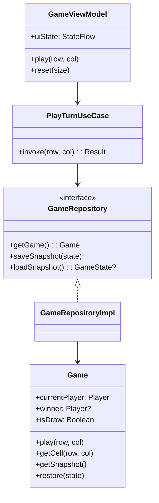

### Layer Descriptions

| Layer | Module | Responsibility |
|-------|--------|----------------|
| **Presentation** | `:app` | UI, ViewModel, Compose components |
| **Domain** | `:domain` | Game logic, UseCases, Repository interface |
| **Data** | `:data` | Repository implementation, data persistence |

### Key Principles

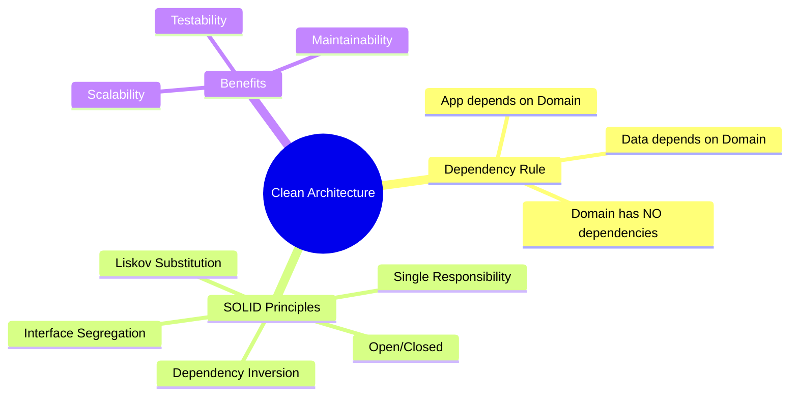

---

## 2. Technical Choices

### Technology Stack

```mermaid
graph LR
    subgraph "🎨 UI"
        COMPOSE[Jetpack Compose]
        M3[Material 3]
    end
    
    subgraph "🏗️ Architecture"
        CLEAN[Clean Architecture]
        MVVM[MVVM Pattern]
    end
    
    subgraph "🔧 DI"
        HILT[Hilt/Dagger]
    end
    
    subgraph "🧪 Testing"
        JUNIT[JUnit 5]
        MOCKK[MockK]
        ROBORAZZI[Roborazzi]
    end
    
    subgraph "📊 Quality"
        DETEKT[Detekt]
        KTLINT[KtLint]
        JACOCO[JaCoCo]
    end
```

| Technology | Purpose |
|------------|---------|
| **Kotlin** | Official language for modern Android development |
| **Jetpack Compose** | Modern declarative UI toolkit for native Android |
| **Hilt** | Dependency injection for improved testability |
| **Clean Architecture** | Separation of concerns and maintainability |
| **JUnit 5** | Modern testing framework with nested tests support |
| **MockK** | Kotlin-native mocking library |
| **Roborazzi** | Screenshot testing for visual regression |

### UI Features

- **Edge-to-Edge Display**: Modern, immersive UI drawing behind system bars
- **Material 3**: Following the latest Material Design guidelines
- **Animations**: Smooth shake animation on game over
- **Haptic Feedback**: Tactile feedback for user actions

---

## 3. Code Quality and CI/CD

### Quality Tools Overview

```mermaid
graph TB
    subgraph "📝 Code"
        CODE[Source Code]
    end
    
    subgraph "🔍 Static Analysis"
        DETEKT[Detekt<br/>Code Smells]
        KTLINT[KtLint<br/>Code Style]
        LINT[Android Lint<br/>Best Practices]
    end
    
    subgraph "🧪 Testing"
        UNIT[Unit Tests]
        INSTR[Instrumentation Tests]
        SCREENSHOT[Screenshot Tests]
    end
    
    subgraph "📊 Coverage"
        JACOCO[JaCoCo]
    end
    
    subgraph "☁️ Cloud"
        SONAR[SonarCloud]
    end
    
    CODE --> DETEKT
    CODE --> KTLINT
    CODE --> LINT
    CODE --> UNIT
    CODE --> INSTR
    CODE --> SCREENSHOT
    
    UNIT --> JACOCO
    INSTR --> JACOCO
    
    DETEKT --> SONAR
    KTLINT --> SONAR
    LINT --> SONAR
    JACOCO --> SONAR
```

### CI/CD Pipeline Architecture

Our CI pipeline uses **6 parallel jobs** for maximum efficiency:

```mermaid
flowchart LR
    subgraph "Stage 1"
        BUILD[🏗️ Build]
    end
    
    subgraph "Stage 2"
        LINT[🔍 Lint]
        TEST[🧪 Test]
        SCREEN[📸 Screenshot]
    end
    
    subgraph "Stage 3"
        INSTR[📱 Instrumentation]
    end
    
    subgraph "Stage 4"
        SONAR[🔎 SonarCloud]
    end
    
    BUILD --> LINT
    BUILD --> TEST
    BUILD --> SCREEN
    
    LINT --> INSTR
    TEST --> INSTR
    
    INSTR --> SONAR
    TEST --> SONAR
    
    style BUILD fill:#4CAF50,color:#fff
    style LINT fill:#2196F3,color:#fff
    style TEST fill:#9C27B0,color:#fff
    style SCREEN fill:#FF9800,color:#fff
    style INSTR fill:#E91E63,color:#fff
    style SONAR fill:#00BCD4,color:#fff
```

| Job | Description | Depends On |
|-----|-------------|------------|
| **Build** | Compiles debug APK, caches artifacts | - |
| **Lint** | Runs Detekt, KtLint, Android Lint | Build |
| **Test** | Unit tests with JaCoCo coverage | Build |
| **Screenshot** | Roborazzi visual regression tests | Build |
| **Instrumentation** | Emulator-based UI tests | Lint, Test |
| **SonarCloud** | Code quality analysis | Test, Instrumentation |

### JaCoCo Coverage Tasks

```mermaid
graph TD
    subgraph "Unit Tests Only 🚀"
        JACOCO_TEST[jacocoTestReport]
    end
    
    subgraph "Instrumentation Only 📱"
        JACOCO_INSTR[jacocoInstrumentationReport]
    end
    
    subgraph "Full Coverage 📊"
        JACOCO_FULL[jacocoFullReport]
    end
    
    JACOCO_TEST --> JACOCO_FULL
    JACOCO_INSTR --> JACOCO_FULL
```

```bash
# Unit tests coverage only (fast, debug variant)
./gradlew jacocoTestReport

# Instrumentation tests coverage only (requires emulator)
./gradlew jacocoInstrumentationReport

# Full coverage report (unit + instrumentation)
./gradlew jacocoFullReport
```

### Test Coverage by Module

| Module | Test Types | Coverage Target |
|--------|------------|-----------------|
| `:app` | Unit, Screenshot, Instrumented | 80% |
| `:domain` | Unit (TDD) | 100% |
| `:data` | Unit | 80% |

### Key CI Features

- **⚡ Gradle Build Cache**: Intelligent caching for faster builds
- **🔄 Concurrency Control**: Cancels redundant workflow runs
- **📊 Rich Summaries**: Detailed GitHub Step Summaries with:
    - Test counts (passed/failed/skipped)
    - Coverage with visual progress bars
    - Links to HTML reports
    - Screenshot comparisons
- **🎚️ KVM Acceleration**: Faster emulator tests
- **📦 Artifact Uploads**: All reports downloadable

### Running Locally

```bash
# Full CI check
./gradlew assembleDebug detekt ktlintCheck lintDebug testDebugUnitTest

# Coverage report
./gradlew jacocoTestReport

# Screenshot tests
./gradlew verifyRoborazziDebug

# Record new screenshots
./gradlew recordRoborazziDebug
```

### Required GitHub Secrets

| Secret | Description |
|--------|-------------|
| `SONAR_TOKEN` | Authentication token for SonarCloud |
| `SONAR_PROJECT_KEY` | Your SonarCloud project identifier |
| `SONAR_ORGANIZATION_KEY` | Your SonarCloud organization |

---

## 4. Contribution Guidelines & Conventions

### Git Workflow

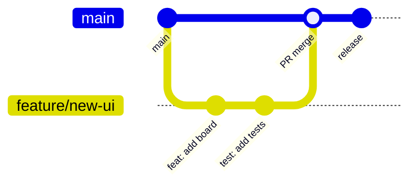

### Git Hooks

Install them with:

```bash
./gradlew installGitHooks
```

### Commit Convention

We follow **Conventional Commits**:

```mermaid
graph LR
    subgraph "Commit Structure"
        TYPE[type] --> SCOPE["(scope)"]
        SCOPE --> SUBJECT[": subject"]
    end
    
    subgraph "Types"
        FEAT[feat ✨]
        FIX[fix 🐛]
        DOCS[docs 📚]
        TEST[test 🧪]
        REFACTOR[refactor ♻️]
    end
```

| Type | Description | Example |
|------|-------------|---------|
| `feat` | New feature | `feat(ui): add game board` |
| `fix` | Bug fix | `fix(game): correct win detection` |
| `docs` | Documentation | `docs: update README` |
| `test` | Tests | `test(game): add TDD tests` |
| `refactor` | Code refactoring | `refactor: extract helper` |
| `style` | Formatting | `style: apply ktlint` |
| `chore` | Maintenance | `chore: update deps` |
| `ci` | CI changes | `ci: add sonar job` |

### Branch Naming

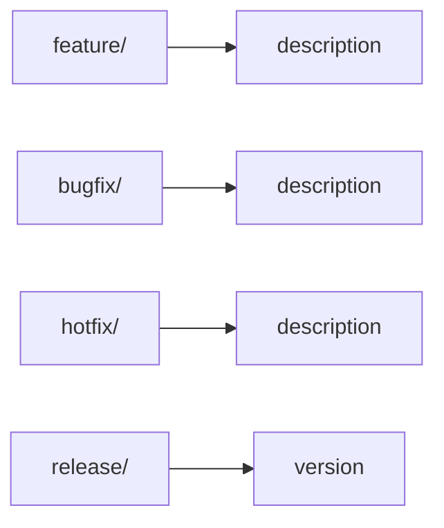

---

## 5. A Deep Dive into Test-Driven Development (TDD)

### The TDD Cycle

```mermaid
graph LR
    RED["🔴 RED<br/>Write failing test"] --> GREEN["🟢 GREEN<br/>Write minimal code"]
    GREEN --> REFACTOR["🔵 REFACTOR<br/>Clean up code"]
    REFACTOR --> RED
    
    style RED fill:#f44336,color:#fff
    style GREEN fill:#4CAF50,color:#fff
    style REFACTOR fill:#2196F3,color:#fff
```

### TDD Timeline for Game Class

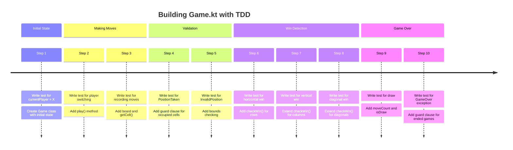

### Test Structure Mapping to Rules

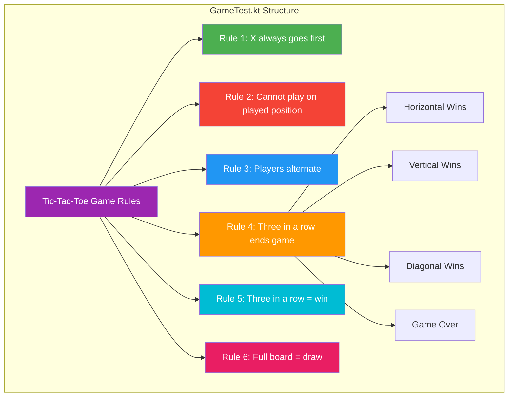

### TDD Step-by-Step Example

#### Step 1: Initial State (Rule 1)

**🔴 RED**: Write a failing test

```kotlin
@Test
fun `new game should start with Player X`() {
    val game = Game() // ❌ Fails: Game doesn't exist
    assertEquals(Player.X, game.currentPlayer)
}
```

**🟢 GREEN**: Write minimal code

```kotlin
class Game {
    val currentPlayer: Player = Player.X
}
```

#### Step 2: Making Moves (Rule 3)

**🔴 RED**: Test player switching

```kotlin
@Test
fun `after X plays, it should be O's turn`() {
    val game = Game()
    game.play(0, 0) // ❌ Fails: play() doesn't exist
    assertEquals(Player.O, game.currentPlayer)
}
```

**🟢 GREEN**: Add play method

```kotlin
fun play(row: Int, col: Int) {
    currentPlayer = Player.O
}
```

**🔵 REFACTOR**: Make it generic

```kotlin
fun play(row: Int, col: Int) {
    currentPlayer = if (currentPlayer == Player.X) Player.O else Player.X
}
```

#### Step 3: Invalid Moves (Rule 2)

**🔴 RED**: Test occupied cell

```kotlin
@Test
fun `playing on occupied cell should throw PositionTaken`() {
    val game = Game()
    game.play(0, 0)
    assertThrows<GameException.PositionTaken> {
        game.play(0, 0) // ❌ Fails: no exception thrown
    }
}
```

**🟢 GREEN**: Add guard clause

```kotlin
fun play(row: Int, col: Int) {
    if (board[row][col] != null) {
        throw GameException.PositionTaken()
    }
    // ... rest of method
}
```

---

## 6. How to Run the Project

### Prerequisites

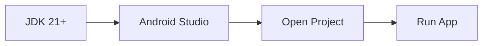

* JDK 21 or higher
* Android Studio Ladybug or higher

### Commands

```bash
# Run Unit Tests (TDD Check)
./gradlew :domain:test

# Build the Application
./gradlew :app:assembleDebug

# Install on device
./gradlew :app:installDebug

# Run all tests with coverage
./gradlew jacocoTestReport
```

---

## 7. Screenshot Testing (Visual Regression)

### Roborazzi Workflow

```mermaid
flowchart TD
    subgraph "Development"
        CODE[Make UI Changes]
        RECORD[./gradlew recordRoborazziDebug]
        COMMIT[Commit Snapshots]
    end
    
    subgraph "CI Pipeline"
        CI_VERIFY[./gradlew verifyRoborazziDebug]
        PASS{Match?}
        SUCCESS[✅ Pass]
        FAIL[❌ Fail + Upload Diff]
    end
    
    CODE --> RECORD
    RECORD --> COMMIT
    COMMIT --> CI_VERIFY
    CI_VERIFY --> PASS
    PASS -->|Yes| SUCCESS
    PASS -->|No| FAIL
```

### Commands

```bash
# Record new/updated screenshots
./gradlew recordRoborazziDebug

# Verify screenshots match
./gradlew verifyRoborazziDebug
```

### Handling Failures

1. Download the `screenshot-report` artifact
2. Open `index.html` to compare expected vs actual
3. If changes are intentional:
   ```bash
   ./gradlew recordRoborazziDebug
   ```
4. Commit the updated snapshots

---

## 8. File Organization

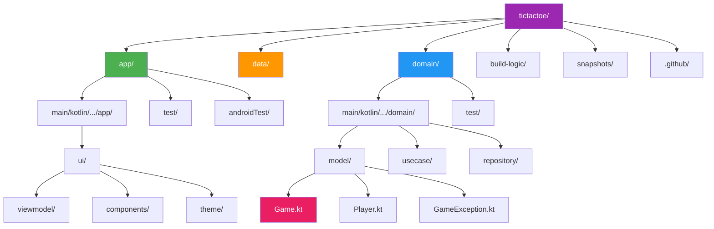

### Directory Structure

```
.
├── app/                  # 📱 Android Module (UI)
│   └── src/
│       ├── main/kotlin/.../app/
│       │   ├── ui/
│       │   │   ├── GameScreen.kt
│       │   │   ├── viewmodel/GameViewModel.kt
│       │   │   ├── components/{Board, Cell, GameControls, GameStatus}.kt
│       │   │   └── theme/{Color, Theme, Type}.kt
│       │   └── di/
│       ├── test/             # Unit + Screenshot tests
│       └── androidTest/      # Instrumentation tests
│
├── data/                 # 💾 Data Module
│   └── src/main/kotlin/.../data/
│       ├── di/DataModule.kt
│       └── repository/GameRepositoryImpl.kt
│
├── domain/               # 🧠 Domain Module (Pure Kotlin)
│   └── src/
│       ├── main/kotlin/.../domain/
│       │   ├── model/{Game, Player, GameState, GameException}.kt
│       │   ├── repository/GameRepository.kt
│       │   └── usecase/{PlayTurn, Reset, Load, GetSnapshot}UseCase.kt
│       └── test/             # TDD unit tests
│
├── build-logic/          # 🔧 Convention Plugins
│   └── convention/
│       └── src/main/kotlin/
│           ├── JacocoConventionPlugin.kt
│           ├── JacocoReportConventionPlugin.kt
│           └── SonarConventionPlugin.kt
│
├── snapshots/            # 📸 Roborazzi golden images
│   └── roborazzi/
│
└── .github/workflows/    # 🚀 CI/CD
    └── android_check.yml
```

---

## 📄 License

This project is created for the BNP Paribas Kata exercise.

---

<p align="center">
  Made with ❤️ using Test-Driven Development
</p>
