# Tic Tac Toe

[](https://github.com/2026-DEV2-007-Hatem-NOUREDDINE/tictactoe/actions/workflows/android_check.yml)
[](https://sonarcloud.io/dashboard?id=2026-DEV2-007-Hatem-NOUREDDINE_tictactoe)
[](https://sonarcloud.io/dashboard?id=2026-DEV2-007-Hatem-NOUREDDINE_tictactoe)


> ## About this Kata
>
> This short and simple Kata should be performed using **Test Driven Development** (TDD).
>
> ## Rules
>
> The rules are described below :
>
> - X always goes first.
> - Players cannot play on a played position.
> - Players alternate placing X’s and O’s on the board until either:
    >

- One player has three in a row, horizontally, vertically or diagonally

>     - All nine squares are filled.
> - If a player is able to draw three X’s or three O’s in a row, that player wins.
> - If all nine squares are filled and neither player has three in a row, the game is a draw.
>
> ## Useful link
>
> Clean Code - TDD : https://cleancoders.com/episode/clean-code-episode-6-p1
>
> **IMPORTANT:**  Implement the requirements focusing on **writing the best code** you can produce.

## 1. Application Architecture

This project follows the **Clean Architecture** pattern, which promotes a separation of concerns and a high degree of independence from external
frameworks. The architecture is organized into three distinct layers (modules):

- **`:app` (Presentation Layer)**: Responsible for the UI and user interactions. It is an Android application module that uses Jetpack Compose for the
  UI and a ViewModel to manage the UI state.

- **`:domain` (Domain Layer)**: Contains the core business logic of the application. It is a pure Kotlin module with no dependencies on the Android
  framework. This layer defines the rules of the game and is completely reusable.

- **`:data` (Data Layer)**: Manages the data sources for the application. In this project, it holds the in-memory representation of the game state and
  could be extended to include data persistence (e.g., saving game state to a database or preferences).

### Key Principles:

- **Dependency Rule**: The layers have a strict dependency rule: `:app` depends on `:domain`, and `:data` depends on `:domain`. The `:domain` layer
  has no dependencies on the other layers. This ensures that the core business logic remains independent and reusable.

- **SOLID Principles**: The architecture adheres to SOLID principles, promoting a modular, maintainable, and scalable codebase.

- **Single Responsibility**: Each layer and class has a single, well-defined responsibility.

## 2. Technical Choices

- **Kotlin**: The official language for modern Android development, providing conciseness, safety, and excellent tooling support.

- **Jetpack Compose**: A modern declarative UI toolkit for building native Android UI. It simplifies UI development and allows for a more reactive and
  maintainable UI.

- **Hilt**: A dependency injection library for Android that simplifies the management of dependencies and improves testability.

- **Clean Architecture**: Chosen to create a clear separation of concerns, making the codebase easier to maintain, test, and scale.

- **Edge-to-Edge Display**: The app provides a modern, immersive UI by drawing content behind the system bars, creating a seamless, edge-to-edge
  experience.

## 3. Code Quality and CI/CD

To maintain a high standard of code quality and ensure the long-term health of the project, we integrate several static analysis tools and automate
our checks using GitHub Actions.

### Code Quality Tools

| Tool             | Purpose                                                               |
|------------------|-----------------------------------------------------------------------|
| **Detekt**       | Static code analysis for Kotlin, detecting code smells and complexity |
| **KtLint**       | Linter and formatter enforcing official Kotlin style guides           |
| **Android Lint** | Android-specific checks for performance, security, and best practices |
| **JaCoCo**       | Code coverage reporting for unit and instrumentation tests            |
| **SonarCloud**   | Continuous inspection platform tracking overall code health           |

### CI/CD Pipeline Architecture

Our CI pipeline uses **6 parallel jobs** for maximum efficiency:

```mermaid
graph LR
    A[🏗️ Build] --> B[🔍 Lint]
    A --> C[🧪 Test]
    A --> D[📸 Screenshot]
    B --> E[📱 Instrumentation]
    C --> E
    E --> F[🔎 SonarCloud]
```



| Job                 | Description                          | Depends On            |
|---------------------|--------------------------------------|-----------------------|
| **Build**           | Compiles debug APK, caches artifacts | -                     |
| **Lint**            | Runs Detekt, KtLint, Android Lint    | Build                 |
| **Test**            | Unit tests with JaCoCo coverage      | Build                 |
| **Screenshot**      | Roborazzi visual regression tests    | Build                 |
| **Instrumentation** | Emulator-based UI tests              | Lint, Test            |
| **SonarCloud**      | Code quality analysis                | Test, Instrumentation |

### Test Coverage by Module

- **`:app`** — Unit tests, Screenshot tests (Roborazzi), Instrumented tests (Emulator)
- **`:domain`** — Unit tests only (pure Kotlin/JVM)
- **`:data`** — Unit tests only

### Key CI Features

- **⚡ Gradle Build Cache**: Uses `gradle/actions/setup-gradle@v4` for intelligent caching, significantly reducing build times.
- **🔄 Concurrency Control**: Automatically cancels redundant workflow runs when new commits are pushed.
- **📊 Rich Summaries**: Each job generates a detailed summary including:
    - Test execution counts (passed/failed/skipped)
    - Per-module code coverage with color indicators
    - List of classes needing more tests
    - Failed test details
- **🎚️ KVM Acceleration**: Emulator tests use KVM for faster execution.
- **📦 Artifact Uploads**: Lint reports, test results, and screenshot diffs are uploaded on failure.

### Running Locally

```bash
# Full CI check
./gradlew assembleDebug detekt ktlintCheck lintDebug testDebugUnitTest

# Coverage report
./gradlew testDebugUnitTestCoverage

# Screenshot tests
./gradlew verifyRoborazziDebug
```

### Required GitHub Secrets

| Secret                   | Description                         |
|--------------------------|-------------------------------------|
| `SONAR_TOKEN`            | Authentication token for SonarCloud |
| `SONAR_PROJECT_KEY`      | Your SonarCloud project identifier  |
| `SONAR_ORGANIZATION_KEY` | Your SonarCloud organization        |

This automated workflow ensures that every contribution is automatically checked for style, potential bugs, and failing tests, maintaining the overall
quality and stability of the application.

## 4. Contribution Guidelines & Conventions

### git-hooks

This project uses Git hooks to automate checks locally. To install them, run:

```bash
./gradlew installGitHooks
```

### Code Style

- **Kotlin**: We follow the official Kotlin Coding Conventions.
- **Hooks**: A `pre-commit` hook automatically formatting your code using KtLint before every commit.

### Commit Messages

We follow **Conventional Commits**: `<type>(<scope>): <subject>`

- **Types**: `feat`, `fix`, `docs`, `style`, `refactor`, `test`, `chore`, `build`, `ci`
- **Example**: `feat(ui): add new game board component`
- **Hook**: A `commit-msg` hook validates your commit messages.

### Branch Cleanliness

- **Naming**: Use standard prefixes: `feature/`, `bugfix/`, `hotfix/`, `release/`
- **Hook**: A `pre-push` hook validates branch names.

## 5. How to Run the Project

### Prerequisites

* JDK 21 or higher.
* Android Studio Otter 2 or higher.

### Commands

**Run Unit Tests (TDD Check):**

```bash
./gradlew :domain:test
```

**Build the Application:**

```bash
./gradlew :app:assembleDebug
```

(Or just click "Run" in Android Studio)

## 6. Screenshot Testing (Visual Regression)

This project uses **Roborazzi** to ensure pixel-perfect UI regression testing.

### **Record Screenshots**

To generate or update the golden images (snapshots), run:

```bash
./gradlew recordRoborazziDebug
```

*Screenshots will be saved in `app/src/test/snapshots`.*

### **Verify Screenshots**

To check if the current UI matches the saved screenshots:

```bash
./gradlew verifyRoborazziDebug
```

*This task runs automatically in the CI pipeline.*
